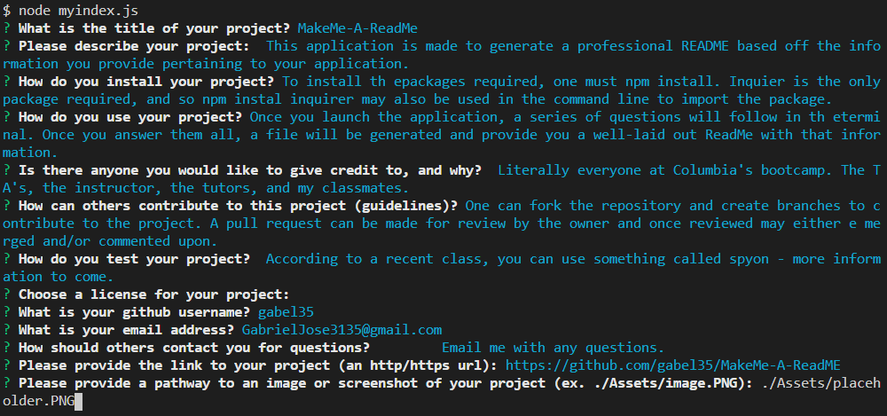

# MakeMe-A-ReadMe

## Description

This application is made to generate a professional README based off the information you provide pertaining to your application.

## Table of Contents

* [Installation](#installation)
* [Usage](#usage)
* [Credits](#credits)
* [Contributing](#contributing)
* [Tests](#tests)
* [License](#license)
* [Questions](#questions)

## Installation

To install the packages required, one must type in "npm install" or "npm i" in the command line.

## Usage

Launch the application by typing "node index.js" in the command line. Once you launch the application, a series of questions will follow in the terminal. Once you answer them all, a file will be generated and provide you a well-laid out ReadMe with that information.

Please follow the following link to the application:
\n[MakeMe-A-ReadMe Repository](https://github.com/gabel35/MakeMe-A-ReadME)

  

## Credits

Literally everyone at Columbia's bootcamp. The TA's, the instructor, the tutors, and my classmates.

### Contributing

One can fork the repository and create branches to contribute to the project. A pull request can be made for review by the owner and once reviewed may either e merged and/or commented upon.
        
### Tests

Currently no tests. Stay tuned.
        
### Licenses

    GNU GPLv3

    Copyright (C) 2021  

    This program is free software: you can redistribute it and/or modify
    it under the terms of the GNU General Public License as published by
    the Free Software Foundation, either version 3 of the License, or
    (at your option) any later version.

    This program is distributed in the hope that it will be useful,
    but WITHOUT ANY WARRANTY; without even the implied warranty of
    MERCHANTABILITY or FITNESS FOR A PARTICULAR PURPOSE.  See the
    GNU General Public License for more details.

    You should have received a copy of the GNU General Public License
    along with this program.  If not, see <https://www.gnu.org/licenses>
    

### Questions

For any addiotional questions:

Email me if you have any questions!

github: [gabel35](https://github.com/gabel35)

email: GabrielJose3135@gmail.com
    
-------------

Thank you!

        